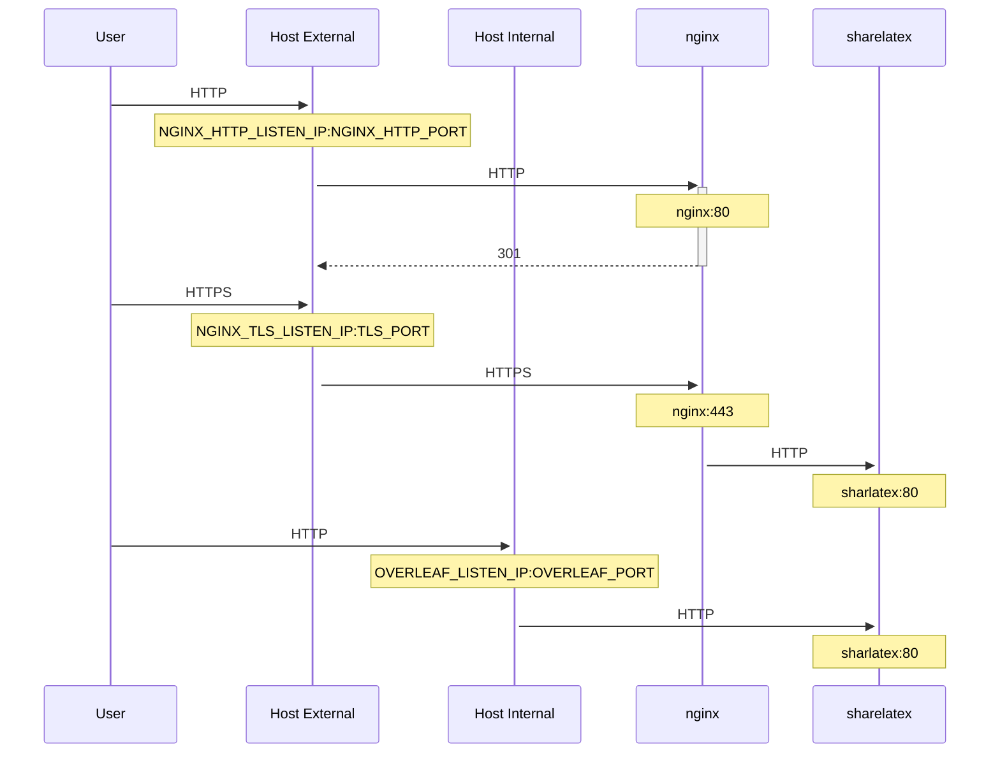

## TLS Proxy for Overleaf Toolkit environment

An optional TLS proxy for terminating https connections, based on NGINX.

Run `bin/init --tls` to initialise local configuration with NGINX proxy configuration, or to add NGINX proxy configuration to an existing local configuration. A sample private key is created in `config/nginx/certs/overleaf_key.pem` and a dummy certificate in `config/nginx/certs/overleaf_certificate.pem`. Either replace these with your actual private key and certificate, or set the values of the `TLS_PRIVATE_KEY_PATH` and `TLS_CERTIFICATE_PATH` variables to the paths of your actual private key and certificate respectively.

A default config for NGINX is provided in `config/nginx/nginx.conf` which may be customised to your requirements. The path to the config file can be changed with the `NGINX_CONFIG_PATH` variable.

In order for Overleaf to run correctly behind the proxy, the following variables should be uncommented in `config/variables.env`

Since Overleaf CE/Server Pro `5.x`:

```
OVERLEAF_BEHIND_PROXY=true
OVERLEAF_SECURE_COOKIE=true
```

For Overleaf CE/Server Pro `4.x` and older versions:

```
SHARELATEX_BEHIND_PROXY=true
SHARELATEX_SECURE_COOKIE=true
```

Add the following section to your `config/overleaf.rc` file if it is not there already:
```
# TLS proxy configuration (optional)
# See documentation in doc/tls-proxy.md
NGINX_ENABLED=false
NGINX_CONFIG_PATH=config/nginx/nginx.conf
NGINX_HTTP_PORT=80
# Replace these IP addresses with the external IP address of your host
NGINX_HTTP_LISTEN_IP=127.0.1.1 
NGINX_TLS_LISTEN_IP=127.0.1.1
TLS_PRIVATE_KEY_PATH=config/nginx/certs/overleaf_key.pem
TLS_CERTIFICATE_PATH=config/nginx/certs/overleaf_certificate.pem
TLS_PORT=443
```
 In order to run the proxy, change the value of the `NGINX_ENABLED` variable in `config/overleaf.rc` from `false` to `true` and re-run `bin/up`.

By default the https web interface will be available on `https://127.0.1.1:443`. Connections to `http://127.0.1.1:80` will be redirected to `https://127.0.1.1:443`. To change the IP address that NGINX listens on, set the `NGINX_HTTP_LISTEN_IP` and `NGINX_TLS_LISTEN_IP` variables. The ports can be changed via the `NGINX_HTTP_PORT` and `TLS_PORT` variables.

If NGINX fails to start with the error message `Error starting userland proxy: listen tcp4 ... bind: address already in use` ensure that `OVERLEAF_LISTEN_IP:OVERLEAF_PORT` does not overlap with `NGINX_HTTP_LISTEN_IP:NGINX_HTTP_PORT`.

