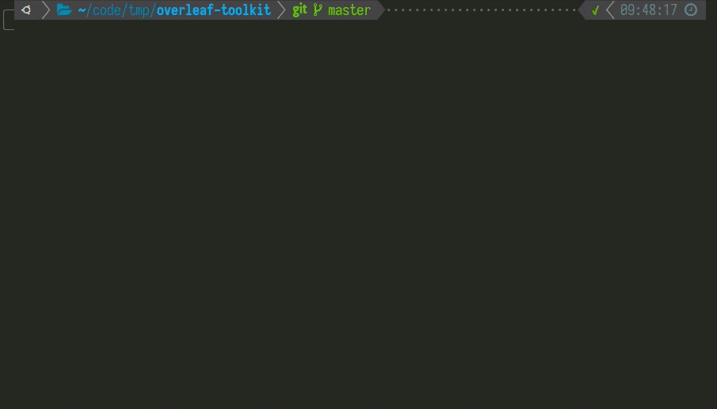

# Upgrading

The Overleaf Toolkit is a git repository, so it's easy to get new toolkit features. Just run `bin/upgrade` and follow the prompts.

It is worth noting that the docker image version (at `config/version`), is managed separately from the toolkit code updates. Updating the toolkit code will not automatically change the version of the docker image that you are running.

## The `bin/upgrade` Script

When you run `bin/upgrade`, the script will check if there is an available update to the toolkit code, and offer to update your toolkit. You can always say no to this upgrade, and nothing will change.

If you do choose to update the toolkit code, the script will then check if the _default_ docker image version has changed, and offer to upgrade your local version file (at `config/version`) to match the new default.

If you do choose to switch versions, the script will then walk you through a process of shutting down the docker services, taking a backup, and restarting the docker services. Your old version file will be automatically copied to `config/__old-version`, just in case you need to roll back to that version of the docker images.

The whole process looks like this:

> Note: For air-gapped setups that manually import docker images, please set `PULL_BEFORE_UPGRADE=false` in your `config/overleaf.rc` file.
